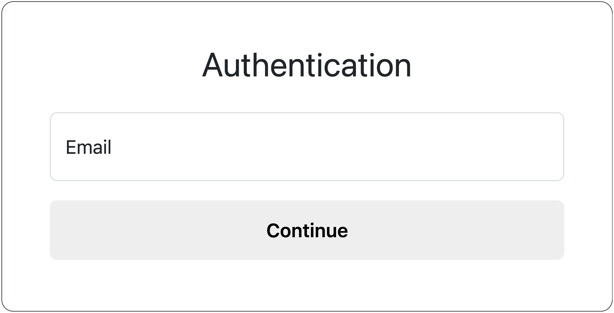
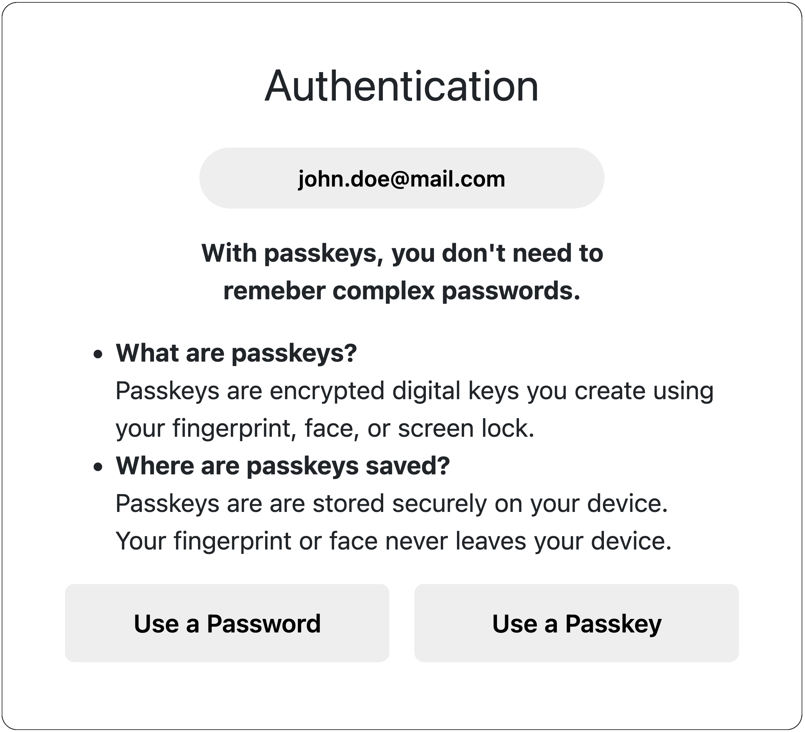

# A Large-Scale Field Study of Passkey Adoption and Usage

Passkeys are a password-less authentication method to improve cybersecurity. We conducted a user study to investigate the adoption and usage of passkeys in a large-scale field study. The study's results are currently undergoing peer review. We published the source code, codebook, and statistical analyses of SPSS.

We introduce our [Live Prototype](https://passkey.uversy.com/) and explain the [Functionality](#functionality). Subsequently, we outline the [Installation](#installation), the [Codebook](#codebook), and the [Statistical Analyses with SPSS](#SPSS).

## Table of Contents
[1. Live Prototype](#live)  
[2. Functionality](#functionality)  
[3. Installation](#installation)  
[4. Codebook](#codebook)  
[5. Statistical Analyses with SPSS (NEW: Regression)](#SPSS)

<a name="live"/>

## 1. Live Prototype

We deployed a live prototype to demonstrate the implementation and to try out passkeys. The implementation is based on [lbuchs/WebAuthn](https://github.com/lbuchs/WebAuthn).  
**Live Prototype:** [https://passkey.uversy.com](https://passkey.uversy.com/)

**The prototype offers the following features:**
- Register an account and log in with a passkey
- Register an account and log in with a password
- Conduct a user study and document authentication rates and times

**Screenshots of the Live Prototype:**
              
  

Figure 1: *Entry of the email for the authentication*

  

Figure 2: *Authentication page for users to choose between a passkey and password*

<a name="functionality"/>

## 2. Functionality

The implementation offers the following functionality.

### General
* Registration and login are not separated in the user interface to streamline the authentication process, meaning the user can authenticate, and the implementation automatically detects whether it was a first-time registration (and creates a new account) or a login
* The order of both buttons `Use a Password` and `Use a Passkey` are randomized each time the website is loaded (try `F5` on Windows or `Cmd + R` on Mac)

### Passkeys
* First Factor: The stored passkey *(something you have)*
* Second Factor: Either users’ biometrics *(something you are)* or the device PIN *(something you know)*
* Users can register multiple passkeys, as recommended by the [FIDO Alliance](https://fidoalliance.org/passkeys/)
* A single device can be used with multiple accounts

### Passwords
* First Factor: The password *(something you know)*
* Second Factor: The SMS OTP *(something you have)*

*Note: In the user study, we used an SMS OTP as a second factor for passwords. This feature contains proprietary code, which is not included in the live prototype or this repository.*

### Collecting Statistics in a User Study
The implementation collects anonymous usage statistics in a MySQL database from a user study. The SQL table *statistic* collects the following values for every authentication attempt:  
* `authentication` *(boolean)* indicates whether a passkey (`1`) or a password (`2`) has been used
* `type` *(boolean)* indicates whether the authentication was a first-time registration (`1`) or a login (`2`)
* `duration` *(int)* contains the duration of the authentication process in **milliseconds**
* `status` *(boolean)* indicates whether the authentication was unsuccessful (`0`) or successful (`1`)
* `date` *(timestamp)* contains the timestamp of the endpoint of the authentication

<a name="installation"/>

## 3. Installation

We describe the installation process, device support, and requirements in the following.

### Installation Process
The implementation code is in the folder [code](code/).

1. `composer require thingengineer/mysqli-database-class:dev-master`
2. Upload the [source code](code/) to the server  
   For improved security, set up directory protection for `/vendor` (created by composer)
3. Replace the following MySQL settings in the file [server.php](code/server.php):
    * `'host' => '_HOST_'`
    * `'username' => '_USERNAME_'`
    * `'password' => '_PASSWORD_'`
    * `'db'=> '_DB_'`
4. Open `[www.your-domain.com]/index.php`

*Note: The database tables are automatically initialized upon the first authentication in the prototype*

### Device support
Passkeys are available on a variety of devices: (see also [passkeys.dev/device-support](https://passkeys.dev/device-support/))
* Apple iOS 16+ / iPadOS 16+ / macOS Ventura+
* Android 9+
* Microsoft Windows 10+

### Requirements  
* PHP >= 8.0 with [OpenSSL](http://php.net/manual/en/book.openssl.php) and [Multibyte String](https://www.php.net/manual/en/book.mbstring.php)
* Browser with [WebAuthn support](https://caniuse.com/webauthn) (Firefox 60+, Chrome 67+, Edge 18+, Safari 13+)
* PHP [Sodium](https://www.php.net/manual/en/book.sodium.php) (or [Sodium Compat](https://github.com/paragonie/sodium_compat) ) for [Ed25519](https://en.wikipedia.org/wiki/EdDSA#Ed25519) support
* MySQL database

<a name="codebook"/>

## 4. Codebook

We outline the codebook based on the qualitative survey results from both phases as follows.   

### Phase 1 Codebook

| **Category**                                | **Codes**                                                                                                                                                                                 |
|---------------------------------------------|-------------------------------------------------------------------------------------------------------------------------------------------------------------------------------------------|
| **Motivating Factors of Passkeys**          | No Memorization Fast Authentication Enhanced Security No Password Creation and Policy Multifactor Ease No Password Resets Other                                         |
| **Concerns of Passkeys**                    | Habit of Using Passwords Lack of Experience or Knowledge Lack of Perceived Benefit Passkey Misconceptions Account Recovery Concerns Multiple Clients Past Negative Experiences Deferred Adoption Privacy and Security Concerns Other |
| **Barriers to Passkey Adoption**            | Passkey Misconceptions Passcode Misconceptions Manual Passkey Activation Perceived Complexity Account Recovery Concerns Multiple Clients Password Manager Integration Biometric Misconceptions Technical Difficulties Other |
| **Barriers to Adopting Passwords with 2FA** | SMS-OTP Password-policy issues Time out Other                                                                                                                                    |

### Phase 2 Codebook

| **Category**                           | **Codes**                                                                                              |
|----------------------------------------|--------------------------------------------------------------------------------------------------------|
| **Reasons for Unsuccessful Logins**    | Unsuccessful Synchronization Device Dependency Technical Difficulties Other                   |
| **Encountered Challenges**             | Passkey Sharing Immutable Storage Location Non-uniform Authentication UI Perceived Loss of Control |
| **Reasons for Unsuccessful Recoveries**| SMS-OTP Other                                                                                       |

<a name="SPSS"/>

## 5. Statistical Analyses with SPSS

We analyzed all quantitative data with the statistical software `SPSS` and published the results in the folder [SPSS](SPSS/).

The study is split into two phases. Phase 1 investigates the adoption of passkeys, and Study 2 explores the usage of passkeys. The participants in Phase 2 are a subset of those in Phase 1. In both phases, we have a group that uses passkeys (Group K) and a group that uses passwords with 2FA (Group W).

### Phase 1 (Passkey Adoption)
In total, there were `5,057` participants in Phase 1: `2,950` in Group K with passkeys and `2107` with passwords with 2FA   
* Participants' gender: [Gender](SPSS/phase1/gender.pdf)
* Participants' age: [Age](SPSS/phase1/age.pdf)
* Participants' education: [Education](SPSS/phase1/education.pdf)
* Participants' Affinity for Technology Interaction (ATI): [ATI](SPSS/phase1/ati.pdf)
* Participants' privacy concerns: [Privacy Concerns](SPSS/phase1/privacy-concerns.pdf)
* Participants' Computer Science (CS) background: [CS background](SPSS/phase1/cs-background.pdf)
* Participants' prior passkey experience: [Prior Exp](SPSS/phase1/prior-exp.pdf)
* Participants' operating system (OS): [OS](SPSS/phase1/os.pdf)
* System Usability Scale (SUS) of authentication method: [SUS](SPSS/phase1/sus.pdf)
* Acceptance scale of authentication method: [Acceptance](SPSS/phase1/acceptance.pdf)

### Phase 2 (Passkey Usage)
* Participants' gender: [Gender](SPSS/phase2/gender.pdf)
* Participants' age: [Age](SPSS/phase2/age.pdf)
* Participants' education: [Education](SPSS/phase2/education.pdf)
* Participants' Affinity for Technology Interaction (ATI): [ATI](SPSS/phase2/ati.pdf)
* Participants' privacy concerns: [Privacy Concerns](SPSS/phase2/privacy-concerns.pdf)
* Participants' Computer Science (CS) background: [CS background](SPSS/phase2/cs-background.pdf)
* Participants' prior passkey experience: [Prior Exp](SPSS/phase2/prior-exp.pdf)
* Participants' operating system (OS): [OS](SPSS/phase2/os.pdf)
* Participants' storage location of passkeys: [Storage](SPSS/phase2/storage.pdf)
* Participants' two-factor authentication method with passkeys: [2FA](SPSS/phase2/2fa.pdf)
* System Usability Scale (SUS) of authentication method: [SUS](SPSS/phase2/sus.pdf)
* Acceptance scale of authentication method: [Acceptance](SPSS/phase2/acceptance.pdf)

### Regression Phase 1 (Passkey Adoption)
The SPSS analysis is available here: [Regression Phase 1](SPSS/regression/phase1.pdf)

|                  |                  |         |       |         |    |       |        | 95% C.I.for EXP(B) | 95% C.I.for EXP(B) |
| ---------------- | ---------------- | ------- | ----- | ------- | -- | ----- | ------ | ------------------ | ------------------
|                  |                  | B       | S.E.  | Wald    | df | Sig.  | Exp(B) | Lower              | Upper |
| Gender           | Female           |         |       | 0.113   | 2  | 0.945 |        |                    |  |
|                  | Male             | \-0.018 | 0.061 | 0.088   | 1  | 0.767 | 0.982  | 0.872              | 1.107 |
|                  | Other            | 0.175   | 1.165 | 0.022   | 1  | 0.881 | 1.191  | 0.121              | 11.682 |
| Age              | 18-19            |         |       | 4.071   | 7  | 0.772 |        |                    |  |
|                  | 20-29            | 0.237   | 0.219 | 1.169   | 1  | 0.280 | 1.267  | 0.825              | 1.947 |
|                  | 30-39            | 0.188   | 0.215 | 0.767   | 1  | 0.381 | 1.207  | 0.792              | 1.840 |
|                  | 40-49            | 0.255   | 0.216 | 1.401   | 1  | 0.237 | 1.291  | 0.846              | 1.970 |
|                  | 50-59            | 0.282   | 0.217 | 1.698   | 1  | 0.193 | 1.326  | 0.867              | 2.028 |
|                  | 60-69            | 0.161   | 0.220 | 0.539   | 1  | 0.463 | 1.175  | 0.764              | 1.807 |
|                  | 70-79            | 0.360   | 0.246 | 2.135   | 1  | 0.144 | 1.433  | 0.884              | 2.321 |
|                  | 80 plus          | 0.193   | 0.375 | 0.264   | 1  | 0.607 | 1.213  | 0.581              | 2.531 |
| Education        | Bachelor         |         |       | 2.990   | 6  | 0.810 |        |                    |  |
|                  | Doctorate        | \-0.075 | 0.241 | 0.097   | 1  | 0.755 | 0.928  | 0.578              | 1.488 |
|                  | High school      | 0.063   | 0.117 | 0.291   | 1  | 0.590 | 1.065  | 0.846              | 1.341 |
|                  | Master           | \-0.040 | 0.177 | 0.051   | 1  | 0.822 | 0.961  | 0.679              | 1.359 |
|                  | Middle school    | 0.014   | 0.114 | 0.015   | 1  | 0.901 | 1.014  | 0.811              | 1.269 |
|                  | Other            | \-0.032 | 0.139 | 0.054   | 1  | 0.816 | 0.968  | 0.737              | 1.271 |
|                  | Still in school  | 0.290   | 0.235 | 1.521   | 1  | 0.217 | 1.336  | 0.843              | 2.118 |
| CS background    | CS background    | 0.060   | 0.106 | 0.313   | 1  | 0.576 | 1.061  | 0.861              | 1.308 |
| Prior Experience | Prior experience | 1.074   | 0.062 | 303.995 | 1  | 0.000 | 2.926  | 2.593              | 3.301 |
| OS               | Android          |         |       | 8.770   | 3  | 0.033 |        |                    |  |
|                  | iOS              | 0.116   | 0.072 | 2.610   | 1  | 0.106 | 1.123  | 0.976              | 1.293 |
|                  | macOS            | \-0.214 | 0.121 | 3.124   | 1  | 0.077 | 0.807  | 0.637              | 1.024 |
|                  | Windows          | \-0.097 | 0.094 | 1.053   | 1  | 0.305 | 0.908  | 0.755              | 1.092 |
| ATI              | ATI              | \-0.087 | 0.033 | 6.743   | 1  | 0.009 | 0.917  | 0.858              | 0.979 |
| Privacy Concerns | PrivacyConcerns  | 0.354   | 0.029 | 151.959 | 1  | 0.000 | 1.424  | 1.346              | 1.506 |
| SUS              | SUS              | 0.010   | 0.002 | 35.868  | 1  | 0.000 | 1.010  | 1.007              | 1.013 |
| Acceptance       | Acceptance       | 0.238   | 0.035 | 46.827  | 1  | 0.000 | 1.268  | 1.185              | 1.358 |
| Constant         | Constant         | \-2.803 | 0.328 | 72.973  | 1  | 0.000 | 0.061  |                    |  |

### Regression Phase 2 (Passkey Usage)
The SPSS analysis is available here: [Regression Phase 2](SPSS/regression/phase2.pdf)

|                  |                  |         |       |         |    |       |        | 95% C.I.for EXP(B) | 95% C.I.for EXP(B) |
| ---------------- | ---------------- | ------- | ----- | ------- | -- | ----- | ------ | ------------------ | ------------------
|                  |                  | B       | S.E.  | Wald    | df | Sig.  | Exp(B) | Lower              | Upper |
| Gender           | Female           |          |           | 2.640   | 2    | 0.267  |                    |  |  |
|                  | Male             | 18.994   | 21535.987 | 0.000   | 1    | 0.999  | 177391786.328      | 0.000 |  |
|                  | Other            | 19.196   | 21535.987 | 0.000   | 1    | 0.999  | 217061617.983      | 0.000 |  |
| Age              | 18-19            |          |           | 4.419   | 7    | 0.730  |                    |  |  |
|                  | 20-29            | \-0.001  | 0.863     | 0.000   | 1    | 1.000  | 0.999              | 0.184 | 5.429 |
|                  | 30-39            | \-0.228  | 0.763     | 0.089   | 1    | 0.765  | 0.796              | 0.179 | 3.551 |
|                  | 40-49            | \-0.398  | 0.758     | 0.275   | 1    | 0.600  | 0.672              | 0.152 | 2.969 |
|                  | 50-59            | \-0.496  | 0.758     | 0.428   | 1    | 0.513  | 0.609              | 0.138 | 2.691 |
|                  | 60-69            | \-0.514  | 0.760     | 0.457   | 1    | 0.499  | 0.598              | 0.135 | 2.655 |
|                  | 70-79            | \-0.519  | 0.766     | 0.460   | 1    | 0.498  | 0.595              | 0.133 | 2.669 |
|                  | 80 plus          | \-0.615  | 0.790     | 0.605   | 1    | 0.437  | 0.541              | 0.115 | 2.545 |
| Education        | Bachelor         |          |           | 6.429   | 6    | 0.377  |                    |  |  |
|                  | Doctorate        | \-0.228  | 0.433     | 0.278   | 1    | 0.598  | 0.796              | 0.341 | 1.859 |
|                  | High school      | 0.003    | 0.564     | 0.000   | 1    | 0.996  | 1.003              | 0.332 | 3.027 |
|                  | Master           | \-0.618  | 0.388     | 2.531   | 1    | 0.112  | 0.539              | 0.252 | 1.154 |
|                  | Middle school    | \-0.294  | 0.483     | 0.371   | 1    | 0.542  | 0.745              | 0.289 | 1.919 |
|                  | Other            | \-0.515  | 0.386     | 1.775   | 1    | 0.183  | 0.598              | 0.280 | 1.274 |
|                  | Still in school  | \-0.457  | 0.418     | 1.196   | 1    | 0.274  | 0.633              | 0.279 | 1.436 |
| CS background    | CS background    | 0.437    | 0.213     | 4.214   | 1    | 0.040  | 1.547              | 1.020 | 2.348 |
| Prior experience | Prior experience | 1.507    | 0.127     | 140.270 | 1    | 0.000  | 4.511              | 3.516 | 5.789 |
| OS               | Android          |          |           | 22.978  | 3    | 0.000  |                    |  |  |
|                  | iOS              | 0.512    | 0.200     | 6.571   | 1    | 0.010  | 1.669              | 1.128 | 2.470 |
|                  | macOS            | 0.845    | 0.216     | 15.376  | 1    | 0.000  | 2.329              | 1.526 | 3.553 |
|                  | Windows          | \-0.164  | 0.313     | 0.275   | 1    | 0.600  | 0.849              | 0.459 | 1.568 |
| Storage location | Another          |          |           | 8.698   | 3    | 0.034  |                    |  |  |
|                  | Built-in         | \-0.403  | 0.553     | 0.529   | 1    | 0.467  | 0.669              | 0.226 | 1.978 |
|                  | I don't know     | 0.433    | 0.224     | 3.740   | 1    | 0.053  | 1.542              | 0.994 | 2.392 |
|                  | PM               | 0.572    | 0.233     | 6.026   | 1    | 0.014  | 1.772              | 1.122 | 2.798 |
| 2FA              | Facial Rec.      |          |           | 26.303  | 4    | 0.000  |                    |  |  |
|                  | Fingerprint      | 0.690    | 0.160     | 18.514  | 1    | 0.000  | 1.993              | 1.456 | 2.729 |
|                  | Password         | 0.758    | 0.178     | 18.213  | 1    | 0.000  | 2.134              | 1.507 | 3.022 |
|                  | Pattern          | 0.078    | 0.280     | 0.077   | 1    | 0.781  | 1.081              | 0.624 | 1.872 |
|                  | PIN              | 0.537    | 0.347     | 2.395   | 1    | 0.122  | 1.711              | 0.867 | 3.380 |
| ATI              | ATI              | \-0.061  | 0.061     | 1.018   | 1    | 0.313  | 0.940              | 0.835 | 1.060 |
| Privacy Concerns | PrivacyConcerns  | \-0.117  | 0.061     | 3.648   | 1    | 0.056  | 0.890              | 0.789 | 1.003 |
| SUS              | SUS              | 0.110    | 0.005     | 508.436 | 1    | 0.000  | 1.116              | 1.105 | 1.127 |
| Acceptance       | Acceptance       | 1.438    | 0.083     | 301.296 | 1    | 0.000  | 4.212              | 3.580 | 4.954 |
| Constant         | Constant         | \-28.443 | 21535.987 | 0.000   | 1    | 0.999  | 0.000              |  |  |
