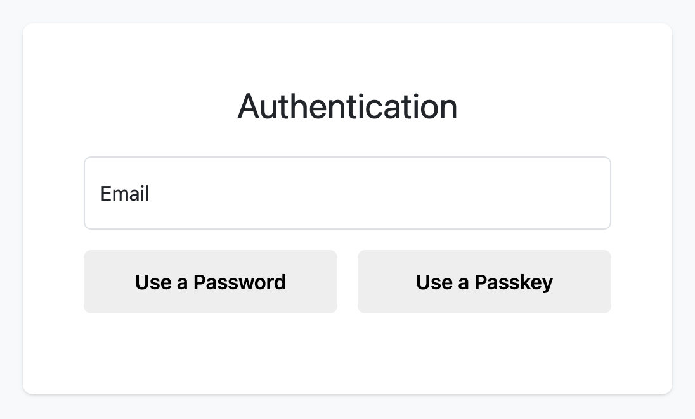

# User Motivation and Experience of Passkeys

Passkeys are a password-less authentication method to improve cybersecurity. We conducted a user study to investigate user motivation and experience of passkeys. The results of the user study are currently in peer review. We published the source code and the statistical analyses of SPSS. The implementation is based on [lbuchs/WebAuthn](https://github.com/lbuchs/WebAuthn).

We introduce our [Live Prototype](https://passkey.uversy.com/) and explain the [Functionality](#functionality). Subsequently, we outline the [Installation](#installation) and the [Statistical Analyses with SPSS](#SPSS).

## Table of Contents
[1. Live Prototype](#live)  
[2. Functionality](#functionality)  
[3. Installation](#installation)  
[4. Statistical Analyses with SPSS](#SPSS)

<a name="live"/>

## 1. Live Prototype

We deployed a live prototype to demonstrate the implementation and to try out passkeys.  
**Live Prototype:** [https://passkey.uversy.com](https://passkey.uversy.com/)

**The prototype offers the following features:**
- Register an account and log in with a passkey
- Register an account and log in with a password
- Conduct a user study and document authentication rates and times

**Screenshot of the Live Prototype:**
              
  

Figure 1: *Authentication page for users to choose between a passkey and password*

<a name="functionality"/>

## 2. Functionality

The implementation offers the following functionality.

### General
* Registration and login are not separated in the user interface to streamline the authentication process, meaning the user can authenticate, and the implementation automatically detects whether it was a first-time registration (and creates a new account) or a login
* The order of both buttons `Use a Password` and `Use a Passkey` are randomized each time the website is loaded (try `F5` on Windows or `Cmd + R` on Mac)

### Passkeys
* First Factor: The stored passkey *(something you have)*
* Second Factor: Either users’ biometrics *(something you are)* or the device PIN *(something you know)*
* Users can register multiple passkeys, as recommended by the [FIDO Alliance](https://fidoalliance.org/passkeys/)
* A single device can be used with multiple accounts

### Passwords
* First Factor: The password *(something you know)*
* Second Factor: The SMS OTP *(something you have)*

*Note: In the user study, we used an SMS OTP as a second factor for passwords. This feature contains proprietary code, which is not included in the live prototype or this repository.*

### Collecting Statistics in a User Study
The implementation collects anonymous usage statistics in a MySQL database from a user study. The SQL table *statistic* collects the following values for every authentication attempt:  
* `authentication` *(boolean)* indicates whether a passkey (`1`) or a password (`2`) has been used
* `type` *(boolean)* indicates whether the authentication was a first-time registration (`1`) or a login (`2`)
* `duration` *(int)* contains the duration of the authentication process in **milliseconds**
* `status` *(boolean)* indicates whether the authentication was unsuccessful (`0`) or successful (`1`)
* `date` *(timestamp)* contains the timestamp of the endpoint of the authentication

<a name="installation"/>

## 3. Installation

We describe the installation process, device support, and requirements in the following.

### Installation Process
The implementation code is in the folder [code](code/).

1. `composer require thingengineer/mysqli-database-class:dev-master`
2. Upload the [source code](code/) to the server  
   For improved security, set up directory protection for `/vendor` (created by composer)
3. Replace the following MySQL settings in the file [server.php](code/server.php):
    * `'host' => '_HOST_'`
    * `'username' => '_USERNAME_'`
    * `'password' => '_PASSWORD_'`
    * `'db'=> '_DB_'`
4. Open `[www.your-domain.com]/index.php`

*Note: The database tables are automatically initialized upon the first authentication in the prototype*

### Device support
Passkeys are available on a variety of devices: (see also [passkeys.dev/device-support](https://passkeys.dev/device-support/))
* Apple iOS 16+ / iPadOS 16+ / macOS Ventura+
* Android 9+
* Microsoft Windows 10+

### Requirements  
* PHP >= 8.0 with [OpenSSL](http://php.net/manual/en/book.openssl.php) and [Multibyte String](https://www.php.net/manual/en/book.mbstring.php)
* Browser with [WebAuthn support](https://caniuse.com/webauthn) (Firefox 60+, Chrome 67+, Edge 18+, Safari 13+)
* PHP [Sodium](https://www.php.net/manual/en/book.sodium.php) (or [Sodium Compat](https://github.com/paragonie/sodium_compat) ) for [Ed25519](https://en.wikipedia.org/wiki/EdDSA#Ed25519) support
* MySQL database

<a name="SPSS"/>

## 4. Statistical Analyses with SPSS

We analyzed all quantitative data with the statistical software `SPSS 29.0.1` and published the results in the folder [SPSS](SPSS/).

We conducted two user studies. Study 1 analyzes users' motivation to use passkeys, and Study 2 investigates users' experiences with passkeys. The participants of Study 2 are a subset of the participants from Study 1. In both studies, we have a group that uses passkeys (`Group K`) and a group that uses passwords (`Group W`). We reference the corresponding Table within the paper for each SPSS document.

### Study 1 (Motivating Factors)
* Participants' demographics from `Table 9` (n=6,750): [Demographics Study 1](SPSS/study1_demographics.pdf)
* Participants' prior experience with passkeys and SMS OTP from `Table 2` (n=6,750): [Prior experience Study 1](SPSS/study1_prior_experience.pdf)

### Study 2 (User Experience)
* Participants' demographics from `Table 10` (n=5,804): [Demographics Study 2](SPSS/study2_demographics.pdf)
* Participants' devices used in registration attempts from `Table 8` (n=6,282): [Registration devices](SPSS/study2_devices_registration.pdf)
* Participants' devices used in login attempts from `Table 8` (n=19,569): [Login devices](SPSS/study2_devices_login.pdf)
